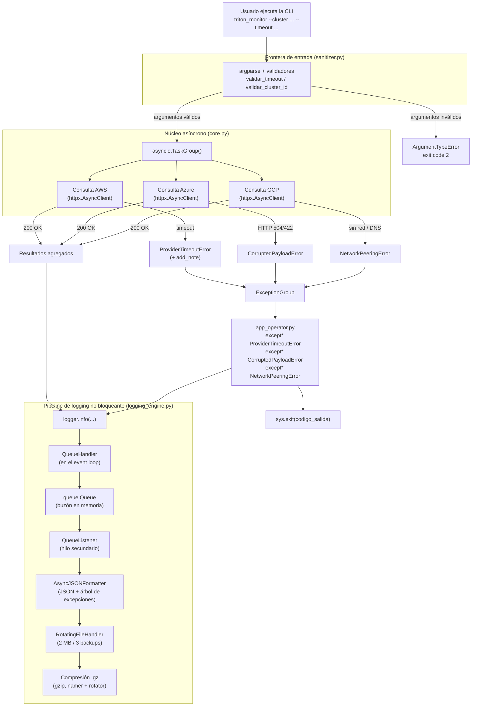

# TritonMonitor

Herramienta de consola (CLI) en Python moderno (3.11+) para consultar el
estado de clústeres multicloud (AWS, Azure, GCP) mediante peticiones HTTP
asíncronas reales, tolerar fallos concurrentes de red y persistir logs
estructurados en JSON comprimido sin bloquear el bucle de eventos.

## Objetivo

El sistema:

1. Consulta APIs reales en paralelo con `httpx`, simulando el monitoreo
   de AWS, Azure y GCP.
2. Gestiona errores concurrentes agrupándolos en un `ExceptionGroup` y
   capturándolos con la sintaxis moderna `except*`.
3. Envía los logs a una cola en memoria (`queue.Queue`) para que un
   hilo en segundo plano (`QueueListener`) los formatee a JSON
   estructurado y los guarde en archivos rotativos comprimidos `.gz`.
4. Valida estrictamente los argumentos de entrada con `argparse`.

## Estructura del proyecto

```
triton_monitor/
├── src/
│   ├── triton_telemetry/
│   │   ├── __init__.py          # Exporta la API pública (__all__)
│   │   ├── exceptions.py        # Jerarquía de excepciones semánticas
│   │   ├── sanitizer.py         # Validadores personalizados para argparse
│   │   ├── core.py              # Lógica asíncrona de red (asyncio + httpx)
│   │   └── logging_engine.py    # Formateador JSON y pipeline de logging
│   ├── app_operator.py          # Punto de entrada ejecutable (CLI + except*)
│   └── tests/
│       └── test_chaos.py        # Suite de pruebas (validadores + caos real)
├── forensic_check.py            # Certifica la estructura de los logs .gz
├── requirements.txt
└── README.md
```

## Arquitectura



## Instalación

```bash
python -m venv .venv
.venv\Scripts\activate      # En Windows
source .venv/bin/activate   # En Linux/Mac
pip install -r requirements.txt
```

## Uso

```bash
python src/app_operator.py --cluster cluster-us-east-01 --timeout 3.0
```

### Argumentos

| Argumento     | Descripción                                                             | Obligatorio |
|---------------|--------------------------------------------------------------------------|:-----------:|
| `--cluster`   | ID del clúster. Formato `cluster-<region>-<numero>` (ej: `cluster-us-east-01`). | Sí |
| `--timeout`   | Timeout de red en segundos, estrictamente entre 0.1 y 5.0.               | Sí |
| `--log-path`  | Ruta del archivo de log rotativo (default: `logs/triton_monitor.log`).   | No |
| `--debug`     | Modo debug: logging detallado (nivel `DEBUG`). Excluyente con `--emergency`. | No |
| `--emergency` | Modo emergencia: solo errores críticos (nivel `ERROR`). Excluyente con `--debug`. | No |

## Escenarios de prueba

| Escenario | Ejemplo de entrada | Comportamiento esperado |
|-----------|---------------------|--------------------------|
| **A — Operación nominal** | `--cluster cluster-us-east-01 --timeout 3.0` | Los 3 proveedores responden `200 OK` y el sistema termina con éxito. |
| **B — Validación temprana CLI** | `--timeout 99` o un cluster ID mal escrito | El validador frena la ejecución al instante y sale con código de error **2**. |
| **C — Inyección de caos** | `--timeout 0.1` | Ocurren fallos concurrentes, se agrupan en `ExceptionGroup`, se capturan con `except*` y se guardan en el log comprimido `.gz`. |

## Tests

```bash
pip install pytest pytest-asyncio --break-system-packages
pytest src/tests/test_chaos.py -v
```

## Certificación forense de logs

Descomprime y valida la estructura de los archivos `.gz` generados
(timestamp ISO 8601, metadatos de entorno y árbol de excepciones):

```bash
python forensic_check.py --log-dir logs
```
